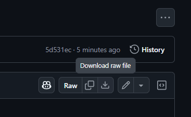

These are my config files for games in the ARK series.  
They are very customised to my own playstyle and may not suit yours.  
I'm sharing this because I've been asked for these files a good few times.

**IMPORTANT:** I've removed my mod IDs from the `GameUserSettings.ini` files so if you replace this and load up your singleplayer screen in the menus, your mods will be deselected. Make sure to reselect them before loading in to your world.
I've also kept but left the value blank for `ServerAdminPassword`, `SpectatorPassword` and `ServerPassword` from these files so make sure to re-add them if you use them.

___
## ASA Configs
To add my configs to your ASA singleplayer save, go to this directory (default install location):  
`C:\Program Files (x86)\Steam\steamapps\common\ARK Survival Ascended\ShooterGame\Saved\Config\Windows`  
Once you're in this directory, your `Game.ini` file can be completely replaced if you wish to do so.  
As for the `GameUserSettings.ini` file, you can't replace this file so you must go to your own version and scroll down until you find the header `[ServerSettings]`. Once you're at that header, you can replace everything below.  
Please note that I have also included my own mod configs in this file but some you may not even be running.

## ASE Configs
Same as the ASA section above but the default directory is here in ASE:  
`C:\Program Files (x86)\Steam\steamapps\common\ARK\ShooterGame\Saved\Config\Windows`  

___
## How do I download?  
To download everything at once, press the green CODE button in the top right, select the local tab and select Download ZIP.  
If you want to download stuff individually, open the file in the folder for the game you want, and press the download button in the top right.  

